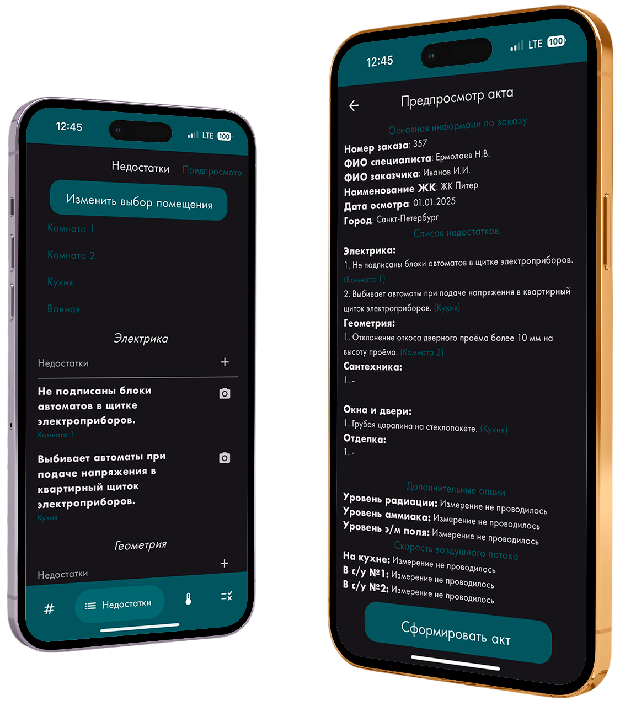
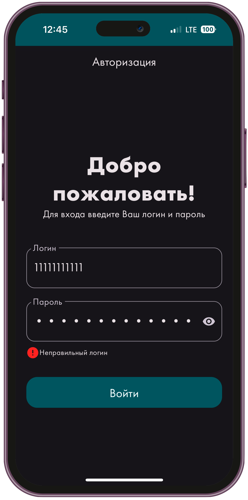
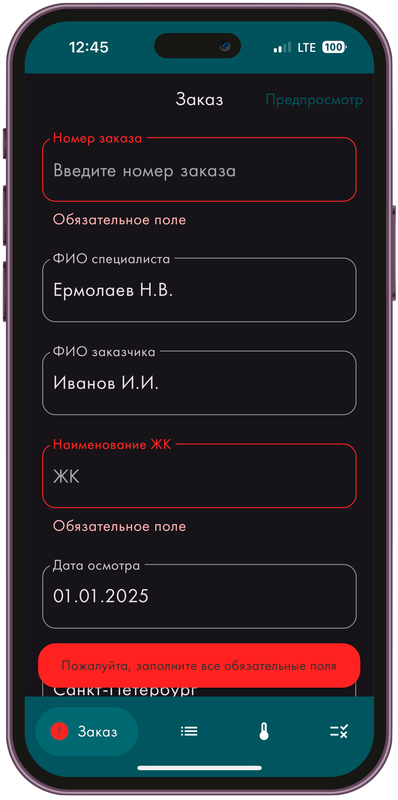
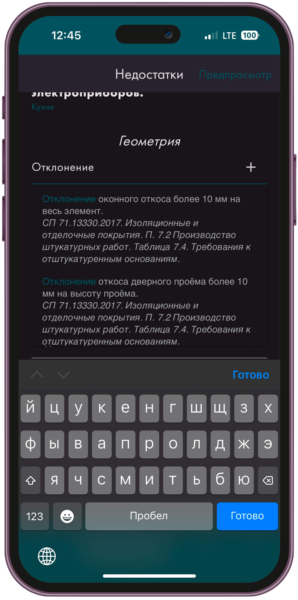
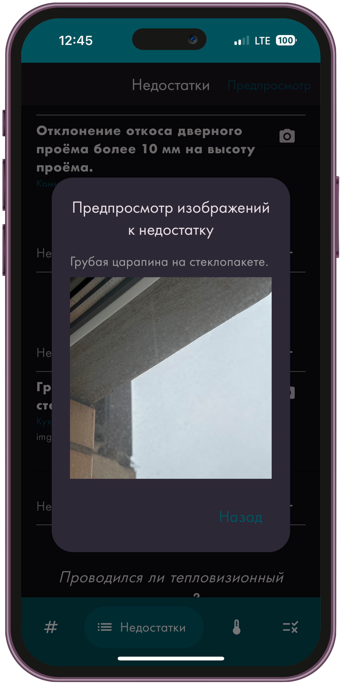
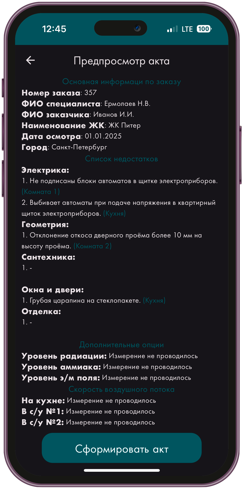
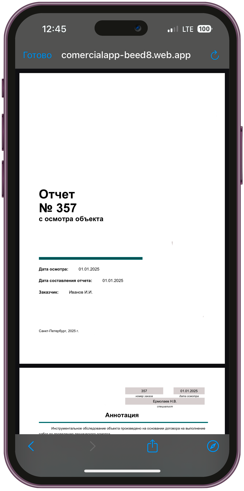

<h1 align="center">Всем привет! Меня зовут Никита.</h1>
<h3 align="center">Я Flutter Developer из России 🇷🇺</h3>

## Описание приложения

Приложение Commercial App разработано для экспертов по приемке квартир. Оно позволяет быстро и удобно внести данные по акту осмотра, фиксировать замечания при осмотре квартиры и прикреплять к ним фотографии.

<p float="left">
  
</p>

## Особенности

### Архитектура

Приложение реализовано на основе принципов Clean Architecture с разделением на следующие слои:
- **core**: стили и утилиты;
- **data**: локальное и удаленное хранилища, модели;
- **domain**: бизнес-логика;
- **presentation**: страницы, тема приложения, UI-виджеты.

Для внедрения зависимостей используется GetIt. Бизнес-логика реализована с использованием BloC (Cubit).

### Авторизация

Авторизация реализована через проверку логина и пароля с использованием Firebase Cloud Firestore. Данные для входа предоставляются заказчиком и могут дополняться разработчиком.

### Хранение данных

Вводимые пользователем данные сохраняются в локальное хранилище с помощью базы данных Hive и сгенерированных адаптеров.

### Взаимодействие с REST API

С помощью REST API реализованы:
- поиск данных о дефектах из базы данных Firebase Cloud Firestore;
- .

## Требования к проекту

- Версия Flutter: **3.10 или выше**
- Версия Dart: **3.3 или выше**

## Установка приложения

1. Клонируйте репозиторий:
    ```bash
    git clone <https://github.com/nyermol/commercial_app.git>
    ```
2. Перейдите в директорию проекта:
    ```bash
    cd <директория вашего проекта>
    ```
3. Установите зависимости:
    ```bash
    flutter pub get
    ```
4. Запустите приложение:
    ```bash
    flutter run
    ```

Приложение также доступно как PWA по ссылке: https://nyermol.github.io/evi_app_web/. Обратите внимание, что доступ к PWA ограничен авторизацией.

## Функциональность приложения

*Авторизация по логину и паролю*

<p float="left">
  
</p>

*Заполнение данных и валидация основных полей*

<p float="left">
  
</p>

*Заполнение недостатков из базы данных или вручную*

<p float="left">
  
  
</p>

*Фиксация недостатков и просмотр фотографий*

<p float="left">
  
</p>

*Предпросмотр введенных данных перед формированием акта*

<p float="left">
  
</p>

*Формирование итогового акта осмотра*

<p float="left">
  
</p>